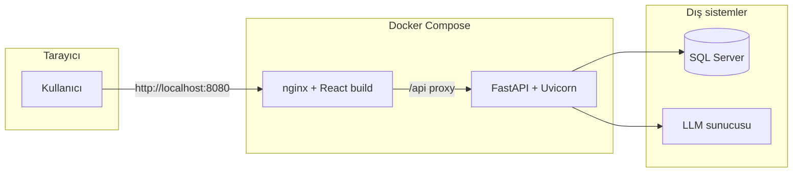

# DWH Code Review (AI SQL Code Review)

SQL Server üzerindeki nesneleri (stored procedure, view, function vb.) seçerek veya yapıştırılan SQL ile **yayımlanmış kurallara göre** LLM destekli inceleme yapan; sonuçları web arayüzünde gösteren ve **CSV / SQL** olarak dışa aktarmayı destekleyen kurumsal bir araçtır.

Uygulama **yalnızca Docker** ile çalıştırılır (`docker compose`). Ortam değişkenleri ve ağ politikaları `docs/ADMIN_GUIDE.md` ile hizalanmalıdır.

---

## İçindekiler

1. [Özellikler](#özellikler)
2. [Mimari](#mimari)
3. [Teknoloji yığını](#teknoloji-yığını)
4. [Dokümantasyon haritası](#dokümantasyon-haritası)
5. [Önkoşullar](#önkoşullar)
6. [Hızlı başlangıç](#hızlı-başlangıç)
7. [Ortam değişkenleri](#ortam-değişkenleri-backendenv)
8. [REST API özeti](#rest-api-özeti)
9. [Güvenlik ve kurumsal ortam](#güvenlik-ve-kurumsal-ortam)
10. [Sorun giderme](#sorun-giderme)
11. [Proje yapısı](#proje-yapısı)

---

## Özellikler

| Alan | Açıklama |
|------|-----------|
| **Veri kaynağı** | SQL Server — ODBC ile bağlantı; veritabanı ve nesne listeleme, nesne tanımı çekme. |
| **İnceleme** | Nesne bazlı veya yapıştırılan script; kurallar `backend/data` altında yönetilir (taslak / yayın). |
| **LLM** | LM Studio veya uyumlu sunucu; `api_v1_chat` veya OpenAI uyumlu `chat/completions` API seçenekleri. |
| **Canlı ilerleme** | Streaming uçları ile kural bazlı ilerleme ve sonuç toplama. |
| **Dışa aktarma** | İnceleme sonuçları için CSV; düzeltme yorumları ile SQL indirme. |
| **Yönetim** | Kurallar, LLM yapılandırması ve isteğe bağlı LLM günlük meta verisi (üretimde ham payload kapalı tutulmalı). |
| **Güvenlik** | İsteğe bağlı API ve admin anahtarları, hız limiti, LLM için private ağ zorunluluğu, tanımlanabilir HTTP User-Agent. |

---

## Mimari



**Akış (özet):** kullanıcı nesne veya SQL seçer → backend tanımı okur veya metni alır → yayımlanmış kurallar için LLM çağrıları yapılır → sonuçlar API ile arayüze döner.

---

## Teknoloji yığını

| Katman | Bileşen | Not |
|--------|---------|-----|
| Çalıştırma | **Docker Compose** | `backend` + `web` servisleri |
| Backend | Python **3.12**, FastAPI, Uvicorn | İmajda **ODBC Driver 18** |
| Veritabanı | **pyodbc** | `MSSQL_CONNECTION_STRING` |
| HTTP istemcisi | **httpx** | LLM; proxy için `LLM_HTTP_TRUST_ENV` |
| Frontend | React, Vite build | Konteynerde **nginx** ile statik servis |
| Yapılandırma | **pydantic-settings**, `backend/.env` | Compose `env_file` |

---

## Dokümantasyon haritası

| Rol | Belge | İçerik |
|-----|--------|--------|
| **Son kullanıcı** | [docs/USER_GUIDE.md](docs/USER_GUIDE.md) | Günlük inceleme, menüler, dışa aktarma |
| **Sistem yöneticisi** | Bu README + [docs/ADMIN_GUIDE.md](docs/ADMIN_GUIDE.md) | LLM, güvenlik, EDR/DLP, proxy |
| **Operasyon / IT** | [docs/KURULUM_CHECKLIST.md](docs/KURULUM_CHECKLIST.md) | Teslim onayı |
| **Docker ayrıntı** | [docs/DOCKER.md](docs/DOCKER.md) | `host.docker.internal`, volume, sorun giderme |

---

## Önkoşullar

1. **Docker Engine** ve **Docker Compose** (Windows: Docker Desktop)
2. **SQL Server** erişimi (ODBC bağlantı dizesi hazır)
3. **LLM endpoint** (LM Studio, iç ağ IP’si veya Tailscale)

Konteyner içinden ana makinedeki SQL/LLM için bağlantı dizesi ve URL’de **`host.docker.internal`** kullanın (ayrıntı: [docs/DOCKER.md](docs/DOCKER.md)).

---

## Hızlı başlangıç

### 1) Ortam dosyası

Proje kökünde:

```powershell
Copy-Item .\backend\.env.example .\backend\.env
```

`backend/.env` içinde SQL Server ve LLM alanlarını doldurun (Docker için `host.docker.internal`).

### 2) Başlatma

```powershell
docker compose up --build
```

Arka planda:

```powershell
docker compose up --build -d
```

Windows’ta isteğe bağlı: `start-docker.bat` / `stop-docker.bat`.

### 3) Adresler

| Servis | URL |
|--------|-----|
| Arayüz | http://localhost:8080 |
| API | http://localhost:8000 |
| Sağlık | http://localhost:8000/api/health |
| OpenAPI | http://localhost:8000/docs |

### 4) Sağlık kontrolü

```powershell
Invoke-WebRequest -UseBasicParsing http://127.0.0.1:8000/api/health
```

### 5) Durdurma

```powershell
docker compose down
```

Kurallar `./backend/data` volume ile kalıcıdır (compose tanımı).

---

## Ortam değişkenleri (`backend/.env`)

| Değişken | Açıklama |
|----------|-----------|
| `MSSQL_CONNECTION_STRING` | SQL Server ODBC bağlantı dizesi |
| `LLM_CHAT_API` | `api_v1_chat` (LM Studio tarzı) veya `openai` uyumlu uç |
| `LLM_BASE_URL` / `LLM_CHAT_URL` | LLM kök veya tam sohbet URL’si |
| `LLM_MODEL` / `SQL_REVIEW_LLM_MODEL` | Model adı; inceleme için `SQL_REVIEW_LLM_MODEL` önceliklidir |
| `LLM_API_KEY` | Gerekirse (barındırıcı istemiyorsa boş) |
| `LLM_HTTP_TRUST_ENV` | `true`: sistem `HTTP(S)_PROXY` kullanılır; yerel LAN LLM için genelde `false` |
| `LLM_HTTP_USER_AGENT` | İsteğe bağlı; LLM isteklerinde sabit tanımlayıcı (log/DLP) |
| `LLM_ENFORCE_PRIVATE_NETWORK` | `true`: LLM hedefi private/Tailscale dışına çıkışı engeller |
| `LLM_ALLOW_PUBLIC_HOSTS` | Virgülle hostname istisnaları |
| `LLM_LOG_FULL_PAYLOADS` | Üretimde **`false`** tutun |
| `SQL_REVIEW_MAX_CONCURRENT_RULES` | Eşzamanlı kural sayısı (ör. 4–8) |
| `LLM_READ_TIMEOUT_SECONDS` / `LLM_REQUEST_RETRIES` | Ağ ve sıra gecikmeleri için |
| `SQL_REVIEW_TWO_PART_THRESHOLD_CHARS` | Çok uzun SQL için iki parçalı analiz eşiği |
| `CORS_ORIGINS` | Doğrudan `:8000` erişiminde gerekir; nginx `:8080` üzerinden `/api` için genelde kritik değil |
| `API_ACCESS_TOKEN` | Doluysa `/api/*` için `X-API-Key` ( `/api/health` hariç ) |
| `API_ADMIN_TOKEN` | Yönetim uçları için `X-Admin-Key` |
| `API_RATE_LIMIT_*` | İnceleme uçlarında hız limiti |

Örnek (Docker Desktop, SQL/LLM ana makinede):

```env
MSSQL_CONNECTION_STRING=Driver={ODBC Driver 18 for SQL Server};Server=host.docker.internal,1433;Database=...;Trusted_Connection=no;UID=...;PWD=...;Encrypt=yes;TrustServerCertificate=yes;
LLM_CHAT_API=api_v1_chat
LLM_BASE_URL=http://host.docker.internal:1234/v1
LLM_MODEL=your/model
SQL_REVIEW_LLM_MODEL=your/model
LLM_HTTP_TRUST_ENV=false
LLM_ENFORCE_PRIVATE_NETWORK=true
LLM_LOG_FULL_PAYLOADS=false
SQL_REVIEW_MAX_CONCURRENT_RULES=6
```

---

## REST API özeti

| Yöntem | Yol | Amaç |
|--------|-----|------|
| GET | `/api/health` | Sağlık (genelde anahtarsız) |
| GET | `/api/databases` | Veritabanı listesi |
| GET | `/api/objects` | Nesne listesi |
| GET/PUT/POST | `/api/rules`, `/api/rules/draft`, `/api/rules/publish` | Kurallar |
| GET/PUT | `/api/llm-config` | LLM yapılandırması |
| GET/DELETE | `/api/llm-logs`, `/api/llm-logs/{id}` | LLM günlük meta |
| POST | `/api/review`, `/api/review/stream` | Nesne inceleme |
| POST | `/api/review/script`, `/api/review/script/stream` | Yapıştırılan script |
| POST | `/api/object-definition` | Nesne tanımı |

Koruma ve anahtarlar için `docs/ADMIN_GUIDE.md` bölümlerine bakın.

---

## Güvenlik ve kurumsal ortam

Üretimde tipik ayarlar: `LLM_ENFORCE_PRIVATE_NETWORK=true`, `LLM_LOG_FULL_PAYLOADS=false`, CORS ve `API_ACCESS_TOKEN` / `API_ADMIN_TOKEN` kurum politikasına göre. Kurumsal proxy için `LLM_HTTP_TRUST_ENV` ile birlikte ortam `HTTP(S)_PROXY` değerleri uyumlu olmalıdır.

EDR, DLP ve ağ izolasyonu için **[docs/ADMIN_GUIDE.md](docs/ADMIN_GUIDE.md)**.

---

## Sorun giderme

| Belirti | Olası çözüm |
|---------|-------------|
| `docker` bulunamıyor | Docker Desktop kurulu ve çalışır olmalı |
| `web` 502 / bekliyor | `docker compose logs backend`; healthcheck ve `.env` |
| SQL bağlantı hatası | `host.docker.internal`; firewall; TCP port |
| LLM bağlantı hatası | `LLM_BASE_URL`, LM Studio dinleme adresi; private ağ politikası |
| `ReadTimeout` | `SQL_REVIEW_MAX_CONCURRENT_RULES` düşürün |
| Port çakışması | 8080/8000 boş mu; `docker compose down` |

Ayrıntılı tablo: [docs/DOCKER.md](docs/DOCKER.md).

---

## Proje yapısı (özet)

```
DWHCodeReview/
├── backend/           # FastAPI (+ Dockerfile)
├── frontend/          # React build (+ Dockerfile, nginx.conf)
├── docker-compose.yml
├── start-docker.bat
├── stop-docker.bat
├── docs/
└── README.md
```

---

## Kurulum sonrası doğrulama

1. http://localhost:8080 açılıyor mu?
2. Veritabanı listesi geliyor mu?
3. İnceleme tamamlanıyor mu?
4. CSV / SQL dışa aktarma çalışıyor mu?
5. `/api/health` başarılı mı?

Operasyonel onay: **[docs/KURULUM_CHECKLIST.md](docs/KURULUM_CHECKLIST.md)**.

---

**Özet:** `backend/.env` → `docker compose up --build` → arayüz **:8080**. Güvenlik için **ADMIN_GUIDE** ve kontrol listesi.
